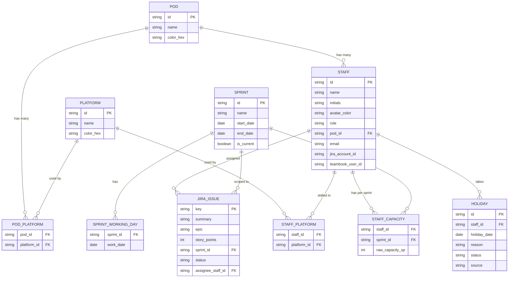

# Backend Integration Requirements

> This document captures the backend/API changes required to move the Resource Tracker prototype from mocked local data to real data sources.
> The frontend prototype will continue to be UI-only until these backend contracts are available.

---

## 1. Overview

The frontend currently reads all data from `src/app/components/mockData.ts`:

- **JIRA stories** are stored inside each `StaffMember.jiraStories`.
- **Demand** is stored inside `StaffMember.sprintData[sprintId].demand`.
- **Holidays** are stored inside `StaffMember.sprintData[sprintId].holidays` and `holidayDates`.

In production, the data must come from:

| Data | Source | Mode |
|---|---|---|
| JIRA issues & story points | JIRA REST API | Read + Write (GET/POST/PUT/DELETE) |
| Staff holidays | Teambook API | Read-only (GET) |
| Demand | Derived from JIRA story points | Computed |
| Staff identity mapping | Internal mapping table / config | Read + Write |

---

## 2. JIRA API Integration

### 2.1 Required operations

The frontend needs the following JIRA operations:

| Operation | Method | Purpose |
|---|---|---|
| `GET /api/jira/issues` | GET | List issues for a sprint (or all sprints), including summary, epic, assignee, status, story points |
| `GET /api/jira/issues?assignee={id}&sprint={sprintId}` | GET | Get issues assigned to one staff member in one sprint |
| `POST /api/jira/issues` | POST | Create a new issue |
| `PUT /api/jira/issues/{issueKey}` | PUT | Update an existing issue (summary, epic, assignee, status, story points, sprint) |
| `DELETE /api/jira/issues/{issueKey}` | DELETE | Delete an issue |
| `POST /api/jira/sync` | POST | Trigger a sync from JIRA to the resource tracker database |

### 2.2 Issue fields needed

```json
{
  "key": "PROJ-101",
  "summary": "Implement OAuth2 login flow",
  "epic": "Auth Revamp",
  "storyPoints": 3,
  "sprintId": "sprint-b",
  "status": "In Progress",
  "assignee": {
    "accountId": "5f1234...",
    "email": "alice.chen@example.com",
    "displayName": "Alice Chen"
  }
}
```

### 2.3 Demand calculation rule

Demand for a staff member in a sprint must be computed as:

```
demand(staff, sprint) = sum(storyPoints)
  for all JIRA issues
  where issue.assignee maps to staff
  and issue.sprintId == sprint
```

The frontend must stop reading `sprintData.demand` from mock data and instead consume this computed value from the backend, or compute it locally from JIRA issue data.

---

## 3. Teambook API Integration

### 3.1 Required operations

| Operation | Method | Purpose |
|---|---|---|
| `GET /api/teambook/holidays` | GET | Fetch approved holidays for a date range |
| `GET /api/teambook/holidays?staff={staffId}&from={date}&to={date}` | GET | Fetch holidays for one staff member in a sprint range |
| `POST /api/teambook/sync` | POST | (Optional) Trigger a sync from Teambook |

### 3.2 Holiday record fields

```json
{
  "staffId": "s1",
  "staffEmail": "alice.chen@example.com",
  "date": "2026-07-03",
  "reason": "Annual leave",
  "status": "approved"
}
```

### 3.3 Holiday data is read-only

The frontend will **not** allow users to add or edit holidays manually. The Holidays tab should become a read-only view with:

- A list of approved holidays per staff member / sprint.
- A "Sync from Teambook" button.
- A warning list for missing holiday data (staff with no Teambook record for the active period).

Effective capacity for a staff member in a sprint must be computed as:

```
effectiveCapacity(staff, sprint) = rawCapacity(staff, sprint) - holidays(staff, sprint)
```

---

## 4. Staff Identity Mapping

Before JIRA and Teambook data can be aggregated correctly, each `StaffMember` must be mapped to external IDs.

### 4.1 Required mapping fields

Extend `StaffMember` with:

```ts
{
  id: string;            // internal resource tracker ID
  email: string;         // used to match JIRA & Teambook
  jiraAccountId?: string;
  teambookUserId?: string;
}
```

### 4.2 Mapping source

The backend should maintain a mapping table or provide an admin endpoint:

| Endpoint | Method | Purpose |
|---|---|---|
| `GET /api/staff` | GET | List staff with their external IDs |
| `PUT /api/staff/{id}/external-ids` | PUT | Update JIRA / Teambook IDs for a staff member |

### 4.3 Open questions

- Should the mapping be auto-discovered by email, or manually configured by an admin?
- What happens if a JIRA assignee does not exist in the resource tracker staff list?
- Should the backend create a placeholder staff record for unknown JIRA users?

---

## 5. Recommended Backend API Surface

For the frontend to stop using mock data, the backend should expose:

### 5.1 Aggregation endpoints (preferred)

| Endpoint | Response |
|---|---|
| `GET /api/capacity?sprint={sprintId}` | Per-staff effective capacity, demand, net available, status |
| `GET /api/capacity/pod/{pod}?sprint={sprintId}` | Per-pod aggregate |
| `GET /api/capacity/platform/{platform}?sprint={sprintId}` | Per-platform aggregate |
| `GET /api/capacity/range?from={sprintId}&to={sprintId}` | Cross-sprint capacity/demand |

This lets the frontend ask for already-computed values instead of aggregating JIRA + Teambook data itself.

### 5.2 Raw data endpoints

| Endpoint | Response |
|---|---|
| `GET /api/jira/issues?sprint={sprintId}` | List of JIRA issues |
| `GET /api/teambook/holidays?from={date}&to={date}` | List of holidays |
| `GET /api/staff` | List of staff with mapping |
| `GET /api/sprints` | List of sprints |
| `GET /api/pods` | List of pods and their platforms |

---

## 6. Data Flow

```
┌─────────────┐     ┌─────────────┐     ┌─────────────────┐
│   JIRA API  │────▶│  Backend    │────▶│  /api/capacity  │──┐
└─────────────┘     │  Aggregator │     │  /api/jira/...  │  │
                    │             │     └─────────────────┘  │
┌─────────────┐     │             │     ┌─────────────────┐  │
│ Teambook API│────▶│             │────▶│ /api/holidays   │  │
└─────────────┘     │             │     └─────────────────┘  │
                    │             │     ┌─────────────────┐  │
┌─────────────┐     │             │────▶│   /api/staff    │◀─┘
│ Admin config│────▶│  Mapping DB │     └─────────────────┘
└─────────────┘     └─────────────┘
```

---

## 7. Frontend Changes Blocked on Backend

The frontend will make these changes once the backend APIs are available:

1. Replace mock `JiraTab` data with `fetch('/api/jira/issues')`.
2. Replace mock `HolidaysTab` data with `fetch('/api/teambook/holidays')`.
3. Replace all `sprintData.demand` reads with demand computed from JIRA issues or `/api/capacity`.
4. Replace all `sprintData.holidays` reads with Teambook data or `/api/capacity`.
5. Add loading, error, and last-synced states to JIRA and Holidays tabs.
6. Remove manual "Add Holiday" button or change it to a "Sync from Teambook" action.

---

## 8. Notes

- Keep the mock data layer in the frontend until the backend is ready; it allows continued UI iteration.
- The backend should be the single source of truth for computed demand and effective capacity.
- Consider caching JIRA and Teambook results to avoid hitting external APIs on every page load.

---

## 9. Database Schema (ER Diagram)

Derived from the current frontend data model (`mockData.ts`): pods can have any number of platforms; staff can have multiple platform skills but belong to exactly **one** pod.



### 9.1 Table notes

| Table | Notes |
|---|---|
| `pod` | No hard limit on platform count (removed the old 1–3 constraint). |
| `pod_platform` | Many-to-many join table — a pod can bind unlimited platforms. |
| `staff` | `pod_id` is a single FK — one staff member belongs to exactly one pod. |
| `staff_platform` | Many-to-many join table — a staff member can have multiple platform skills, independent of their pod's platforms. |
| `staff_capacity` | Raw capacity (SP) per staff per sprint, before holiday deduction. Effective capacity = `raw_capacity_sp - holidays(staff, sprint)`. |
| `holiday` | Sourced from Teambook, read-only from the frontend's perspective; `status` e.g. `approved`/`pending`. |
| `jira_issue` | `story_points` drives computed demand; `assignee_staff_id` is resolved from JIRA's `accountId` via the staff mapping. |
| `sprint_working_day` | Precomputed list of working days (Mon–Fri) per sprint, used for the holiday calendar strip in the UI. |

### 9.2 Derived / computed values (not stored, computed on read)

- `demand(staff, sprint)` = `SUM(jira_issue.story_points) WHERE assignee_staff_id = staff AND sprint_id = sprint`
- `effective_capacity(staff, sprint)` = `staff_capacity.raw_capacity_sp - COUNT(holiday WHERE staff_id = staff AND holiday_date IN sprint.working_days)`
- `net_available(staff, sprint)` = `effective_capacity - demand`
- `status(staff, sprint)` = derived from `net_available` thresholds (`available` ≥ 2, `tight` 0–1, `over` < 0)
- Pod/platform aggregates = `SUM`/`AVG` of the above grouped by `pod_id` or `platform_id`

---

## 10. Complete Backend API List

Consolidated list of every endpoint the frontend needs, grouped by resource. All `GET` endpoints are safe to cache; write endpoints should be authenticated/authorized for delivery leads only.

### 10.1 Staff

| Method | Endpoint | Purpose |
|---|---|---|
| GET | `/api/staff` | List all staff, with pod, platforms, and external ID mappings |
| GET | `/api/staff/{id}` | Get one staff member's full profile |
| PUT | `/api/staff/{id}` | Update staff profile (name, role, avatar) |
| PUT | `/api/staff/{id}/pod` | Reassign staff to a different pod (single pod only) |
| PUT | `/api/staff/{id}/platforms` | Update the set of platform skills for a staff member |
| PUT | `/api/staff/{id}/external-ids` | Update `jiraAccountId` / `teambookUserId` mapping |

### 10.2 Pods

| Method | Endpoint | Purpose |
|---|---|---|
| GET | `/api/pods` | List all pods with their bound platforms and color |
| GET | `/api/pods/{id}` | Get one pod's config and current staff roster |
| POST | `/api/pods` | Create a new pod |
| PUT | `/api/pods/{id}` | Rename pod / change color |
| PUT | `/api/pods/{id}/platforms` | Update the set of platforms bound to a pod (no count limit) |
| POST | `/api/pods/{id}/staff` | Batch-assign staff to a pod |
| DELETE | `/api/pods/{id}/staff/{staffId}` | Remove a staff member from a pod |
| DELETE | `/api/pods/{id}` | Delete a pod (only if empty) |

### 10.3 Sprints

| Method | Endpoint | Purpose |
|---|---|---|
| GET | `/api/sprints` | List all sprints (id, name, dates, working days, `isCurrent`) |
| GET | `/api/sprints/{id}` | Get one sprint's detail |
| POST | `/api/sprints` | Create a new sprint |
| PUT | `/api/sprints/{id}` | Update sprint dates / mark as current |

### 10.4 Capacity (raw, editable)

| Method | Endpoint | Purpose |
|---|---|---|
| GET | `/api/capacity/raw?sprint={sprintId}` | List each staff member's raw (pre-holiday) capacity for a sprint |
| PUT | `/api/capacity/raw` | Bulk update raw capacity per staff per sprint |

### 10.5 JIRA

| Method | Endpoint | Purpose |
|---|---|---|
| GET | `/api/jira/issues?sprint={sprintId}` | List issues for a sprint |
| GET | `/api/jira/issues?assignee={staffId}&sprint={sprintId}` | List issues for one staff member in one sprint |
| POST | `/api/jira/issues` | Create a new issue |
| PUT | `/api/jira/issues/{issueKey}` | Update an issue |
| DELETE | `/api/jira/issues/{issueKey}` | Delete an issue |
| POST | `/api/jira/sync` | Trigger sync from JIRA |

### 10.6 Holidays (read-only from frontend)

| Method | Endpoint | Purpose |
|---|---|---|
| GET | `/api/teambook/holidays?from={date}&to={date}` | List holidays in a date range |
| GET | `/api/teambook/holidays?staff={staffId}&from={date}&to={date}` | List holidays for one staff member |
| POST | `/api/teambook/sync` | Trigger sync from Teambook |

### 10.7 Aggregation (computed, preferred over raw data for the UI)

| Method | Endpoint | Purpose |
|---|---|---|
| GET | `/api/capacity?sprint={sprintId}` | Per-staff effective capacity, demand, net available, status |
| GET | `/api/capacity/range?from={sprintId}&to={sprintId}` | Cross-sprint capacity/demand per staff |
| GET | `/api/capacity/pod/{podId}?sprint={sprintId}` | Per-pod aggregate for one sprint |
| GET | `/api/capacity/pod/{podId}/range?from={sprintId}&to={sprintId}` | Per-pod aggregate across a sprint range |
| GET | `/api/capacity/platform/{platform}?sprint={sprintId}` | Per-platform aggregate |
| GET | `/api/reports/summary?from={sprintId}&to={sprintId}` | Data backing the Reports page |

### 10.8 Auth (assumed, not detailed here)

| Method | Endpoint | Purpose |
|---|---|---|
| GET | `/api/me` | Current logged-in delivery lead / permissions |
